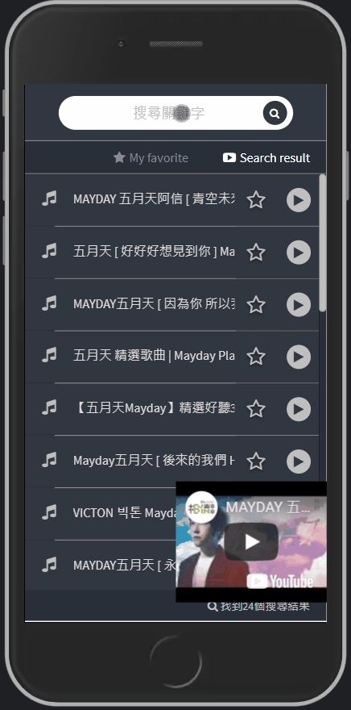

# NTU-ICAN-YOUTUBE-PLAYER CLI


> Notes: https://mike-zheng.github.io/posts/9d2dfbbd/


## What is NTU-ICAN-YOUTUBE-PLAYER?

- **Enjoy Together** - NTU-ICAN-YOUTUBE-PLAYER is an online music player that can help all members of the laboratory share music.

- **Simple to Use** - Searching for music based on youtube is easy. And provide a collection function.

- **Feature** - Members can play/pause, volum up/down the music in time.

--------------------------------------
## Installation & Develop

> The NTU ICAN youtube-player is written in AngularJS.


``` bash
npm install 
gulp
```

--------------------------------------

## Playground

https://mike-zheng.github.io/NTU-ICAN-YOUTUBE-PLAYER/

## App Snapshot


## Mobile Snapshot

